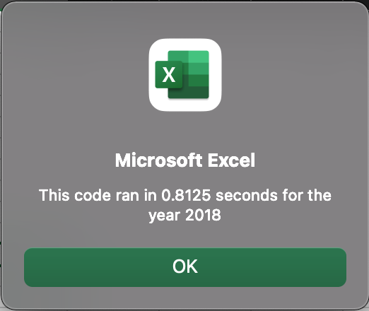
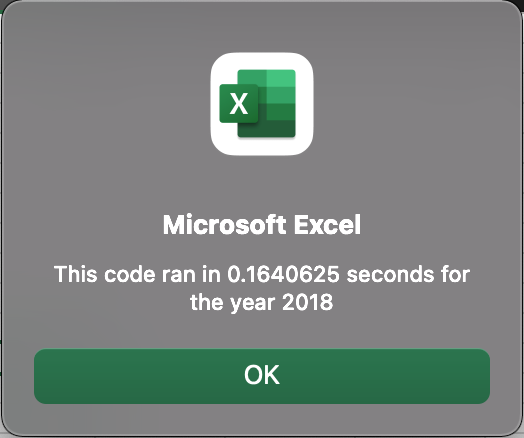

# Green-Energy Stock Analysis
## Project Overview 
### Background 
By utilizing VBA (Microsoft Visual Basics for Applications), I was able to analyze data provided (from 2017 and 2018) specifically the ‘yearly return’ and ‘total daily volume’.

For this purpose, I used for loops, conditional formatting and statements amongst several other operators. Furthermore, on running the code and observing the run time - I refactored it such that the run-time was reduced to increase efficiency. 

I enjoyed coding in VBA immensely, owing to the ease in transfer of basic to advanced repetitive tasks. I was and am able to come back to the original or updated file in order to improve it as per my convenience at any point in time. Since, it is a standalone application - I have not had to further install any libraries / packages or applications to either update current code or run further data analysis, and it has proceeded to integrate effectively with Microsoft applications.

For your reference, within the [VBA_Challenge file](VBA_Challenge.xlsm) you can find the base code (Module 2) and the refactored code (Module 3) upon opening MIcrosoft Visual Basic Editor (Option + fn + F11 [mac users])

### Purpose
The final outcome of this data analysis pertains to Steve determining whether certain green-energy stocks are viable investments for his parents.

Quite specifically, they are looking to invest in DAQO stocks (Ticker: DQ).
According to Bloomberg: “Daqo New Energy Corporation manufactures polysilicon. The Company markets its polysilicon to photovoltaic product manufacturers who process it into ingots, wafers, cells and modules for solar power products.” (https://www.bloomberg.com/quote/DQ:US)

## Building the code and Table Outputs:
Both scripts built in Module 2 (base code) and module 3 (refactored code) presented with the same output, derriving input data fron the following  [dataset](VBA_Challenge.xlsm) under datasheets 2017 and 2018. Output was returned within a seprate worksheet titled **"All_Stock_Analysis"** presenting a table with three individual columns, each column referencing a different statistic (Ticker name, Total Daily Volume, and Yearly return) for the unique ticker that they relate to. The only diffenerce, that we shall delve into the specifics of a little later down this README, being the overall efficiency in run time of the executon of each block of code.

### Ticker:
Column A holds our ticker array `Dim tickers(12) As String` holding 12 elements - one element for each of the twelve tickers being examined. Creating a  ariable called `tickerIndex` allows us to recall and access array indexes as well as returning the specified values in their allocated location under the **"All_Stock_Analysis"** worksheet. 

###  Total Daily Volume:
In order to code the output for Total Daily Volume, we firstly had to specify an equation `tickerVolumes(tickerIndex) + Cells(i, 9).Value` that would allow for the calulation to be completed at least once for a single ticker before telling our script to loop it through the 11 remaining. by creating an array called tickerVolumes `Dim tickerVolumes(12) As Long`, we were consequently abke to use the previously created variable `tickerIndex` to properly store correct values for each ticker within the table.

Reulting in our final line looking like `tickerVolumes(tickerIndex) = tickerVolumes(tickerIndex) + Cells(i, 9).Value`

###  Yearly Return:

In order to code for **Yearly Return** the use of conditional (IF-THEN) statemnets had to be employed
```
If Cells(i - 1, 1).Value <> ticker And Cells(i, 1) = ticker Then
            tickerStartingPrices(tickerIndex) = Cells(i, 6).Value
            
End If

If Cells(i, 1).Value = ticker And Cells(i + 1, 1).Value <> ticker Then
            tickerEndingPrices(tickerIndex) = Cells(i, 6).Value
            
End If
```
As before, the variable `tickerIndex` helps us find the starting and ending point of an old/new ticker in the dataset. Arrays `Dim tickerStartingPrices(12) As Single` and `Dim tickerEndingPrices(12) As Single` store captured values.
In “human” language we would read the following code something like this: 

>If the cell value in previous row (2nd column) is not the same as current cell value (2nd column), (that means the ticker index has reached a starting point of the new ticker), then capture the value for starting price of a new ticker in a current row (7th column) and store it in a “container” named tickerEndingPrices under label “current” tickerIndex. And similarly for ending prices.

#### For loops
For loops are responsible for executing the code in a repetitive manner until the condition is met. 
Incrementing a variable by 1  `tickerIndex = tickerIndex + 1` is  responsible to move to the next ticker.
By initializing arrays `tickerVolumes(tickerIndex) = 0` we reset the total volume to zero, before entering the loop again. 

#### Formatting 
In order to present our final table in an organized and visually engaging manner, Microsoft Visual Basic Editor allows for both conditional as well as Static formatting as one would normally do within excel itself. 

Examples of sytax and various forms of user available formatting can be found [over here](https://www.excelhowto.com/macros/formatting-a-range-of-cells-in-excel-vba/). For reference purposes I have included below lines of formatting that can be visible within the code I built:

`
'makes headers Bold
    Range("A3:C3").Font.FontStyle = "Bold"
    
'Adds a border
    Range("A3:C3").Borders(xlEdgeBottom).LineStyle = xlContinuous
    
'Formats cells B4/C4 -> B15/C15 in numerical format respectively
    Range("B4:B15").NumberFormat = "#,##0"
    Range("C4:C15").NumberFormat = "0.0%"

'Auto fits all contents of any cell found in Column B
    Columns("B").AutoFit
`

An example of conditional formatting:
`
dataRowStart = 4
    dataRowEnd = 15

    For i = dataRowStart To dataRowEnd
        
        If Cells(i, 3) > 0 Then
            
            Cells(i, 3).Interior.Color = vbGreen
            
        Else
        
            Cells(i, 3).Interior.Color = vbRed
            
        End If
        
    Next i
`
By applying conditionals we can set the circumsatnce in which the foramtting is applied i.e. in our example above should the cells contents be greater than 0, it is colored in green otherwise it is colored in red.

### Comparison after refacotring
Table below shows main diferences between code *before refactoring* and code *after refactoring* and their *run-time*. 

Code before refactoring (Module 1). |  Code after refactoring (Module 2).
:------------------------------------------:| :-------------------------------------:
Code with nested loops(click to enlarge).  | Code without nested loops creating multiple loops (click to enlarge).	
 | 
The code in a nested loop is switching back and forth between worksheets. | Code stays in the same loop, gathers all data and stores it in arrays. In a separate for loop the results are populated in the selected worksheet.  
 Execution time of the base code: |  Execution time of the refactored code:
 | 

<p align="center">
:heavy_check_mark: The refactored code runs almost 5x faster.
</p>

## Comparison and Analysis of  green energy stocks - 2017 vs 2018
(Figure 1) | (Figure 2)
:------------------------------------------:| :-------------------------------------:	
 | 
All stocks Result 2017 (click to enlarge).  | All stocks Result 2018 (click to enlarge).

### Annual Returns (%)
The table shown in Fig. 1 and Fig. 2 have columns that refer to each of the 12 company’s ticker name, Total daily volume (for the given year) and Returns (Annual in Percentage).

Fig.1 i.e. for the year 2017 shows positive returns for all but 1 of the 12 companies and can be quite deceiving since Fig.2 shows that the companies unanimously had negative returns.

In conclusion, based on annual returns alone we can deduce that these are extremely volatile stocks and a very risky investment.

### Total Daily Volume (for the given year)

In general, high volumes of trading daily may show that a company’s stock is doing well.

Specific to the company DQ, its stocks had a low trading volume daily in 2017 but high annual returns. But just as in the previous scenario, in 2018 we see that there has been a complete flip and the opposite can be observed with a year-end of negative 63%. 

In conclusion, DQ stocks are definitely a very risky and even dangerous investment especially if Steve’s parents were to invest all their money into these since the analysis shows how despite high trading volume the outcomes have been negligible and not worth it.
